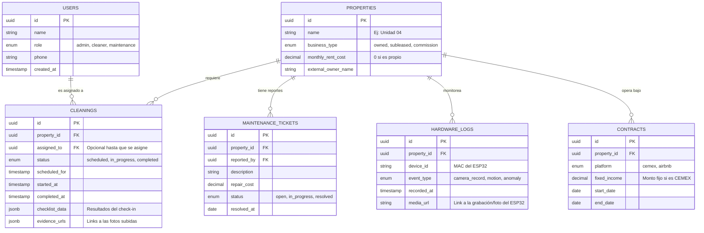

# Esquema de Base de Datos - CClean PWA

A continuación se detalla la arquitectura de la base de datos relacional sugerida (PostgreSQL / Supabase) para soportar las reglas de negocio de los 5+ departamentos, el control financiero y la integración con el hardware *y4ga-bot*.

## Diagrama Entidad-Relación (ER)

---

## Detalle de Tablas y Lógica de Negocio

### 1. `PROPERTIES` (Departamentos) y `CONTRACTS` (Contratos)
Al separar la propiedad del contrato, logramos la flexibilidad que buscas:
* Hoy, el Departamento 2 puede tener un registro en `CONTRACTS` de tipo `cemex` que inyecta automáticamente un ingreso fijo mensual en el dashboard financiero.
* En 2 años, ese contrato expira. Simplemente agregas un nuevo registro de tipo `airbnb` para ese mismo departamento, cambiando su lógica a ingresos dinámicos por reserva, sin perder el historial de mantenimientos pasados.

### 2. `CLEANINGS` (Operación Móvil)
Esta tabla es el corazón de la App de las colaboradoras.
* **`checklist_data` (JSONB):** Guardar el checklist como JSON permite que un departamento tenga preguntas distintas a otro sin alterar la base de datos (Ej. En el de Airbnb preguntas si dejaron chocolates, en el de CEMEX no).
* **Marcas de Tiempo (Timestamps):** `started_at` se llena cuando presionan el botón gigante, `completed_at` cuando envían las fotos. La diferencia entre ambos te da métricas exactas de cuánto tardan por departamento.

### 3. `HARDWARE_LOGS` (Integración y4ga-bot / ESP32)
Esta tabla está diseñada para recibir "Webhooks" o peticiones directas desde tus placas ESP32.
* Cuando una colaboradora de limpieza inicia sesión o si hay movimiento detectado, el ESP32 envía un POST a la API.
* Se guarda el `event_type` y la URL del clip de video en la nube (AWS S3, Supabase Storage, etc.).
* Esto alimenta el **Centro de Alertas** del Dashboard de tu mamá, dándole evidencia en video de que las reglas de integridad de los inquilinos se están respetando.

### 4. `MAINTENANCE_TICKETS` (Desperfectos)
Crucial para el cálculo automático de rentabilidad. Cuando arreglas un desperfecto (plomería), el `repair_cost` se suma a los egresos del mes. El sistema resta esto del ingreso del contrato de ese departamento, dándote tu ganancia neta real.
