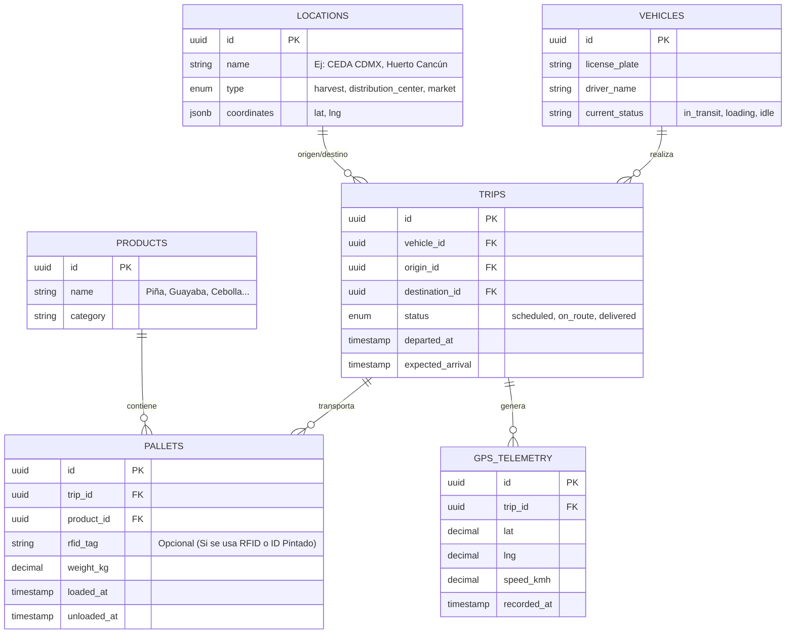

# Arquitectura Backend - YAGA Logística Agrícola

El proyecto YAGA requiere un backend robusto capaz de manejar telemetría en tiempo real (GPS de vehículos) y trazabilidad de inventario a gran escala (toneladas de frutas/verduras en tarimas) a través de múltiples nodos (CEDA CDMX, Cancún, zonas de cosecha).

---

## 💡 Alternativas a Códigos QR para Trazabilidad de Tarimas

Imprimir códigos QR en entornos agrícolas (tierra, humedad, montacargas) no es viable porque el papel se rompe, se mancha o se pierde. Aquí tienes las 3 mejores opciones para tu logística:

### 1. Etiquetas RFID UHF (La opción más profesional y escalable)
* **Cómo funciona:** Se atornilla o pega un pequeño "tag" plástico resistente en cada tarima (madera o plástico). 
* **Ventajas:** No requiere línea de visión. Un escáner RFID en la puerta del camión o en el andén de la Central de Abastos lee **todas las tarimas del camión en 2 segundos** automáticamente al pasar.
* **Costo:** El tag cuesta unos pocos centavos de dólar. Los escáneres son la inversión fuerte (o usar terminales portátiles).

### 2. Visión Artificial (Cámaras + IA) con IDs Pintados
* **Cómo funciona:** Las tarimas se marcan permanentemente con esténcil y pintura (Ej: `YAGA-001` a `YAGA-500`). 
* **Ventajas:** Puedes usar el mismo hardware que ya estás desarrollando (como el **y4ga-bot** o cámaras de celular). El operador simplemente toma una foto a la carga y la IA extrae los números de las tarimas y detecta visualmente el tipo de producto (piña, mango, etc.).
* **Costo:** Muy bajo en hardware, requiere integrar OCR/Visión en el backend.

### 3. Asignación Lógica por Viaje (Sin IDs en Tarimas)
* **Cómo funciona:** Si las tarimas no se devuelven o se mezclan, en lugar de trackear *la tarima física*, trackeas *el lote*. 
* **Ventajas:** Cero hardware. El conductor de la unidad registra en la App: *"Camión XYZ carga 15 tarimas de Mango y 10 de Guayaba"*. El GPS del camión le da trazabilidad a la carga completa. Al llegar a CEDA, se descargan y se da por completado el lote.

---

## 🗄️ Esquema de Base de Datos (PostgreSQL / Supabase)

Para soportar esto, el backend debe separar el "Vehículo" de la "Carga".

### Lógica del Flujo de Trabajo (Backend)

1. **Cosecha (Origen):** Se crea un `TRIP`. El operador enlista cuántos `PALLETS` de qué `PRODUCT` subieron al camión.
2. **Tránsito:** El módulo GPS envía pings cada minuto a la tabla `GPS_TELEMETRY`, vinculados al `trip_id`. El Dashboard de YAGA muestra el camión moviéndose en el mapa.
3. **Descarga en CEDA / Cancún:** Llega el camión. Se escanean las tarimas (vía RFID o OCR) o se confirma la descarga manual. El viaje cambia a estado `delivered`.
